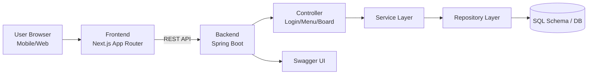
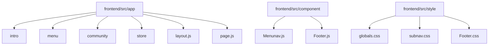
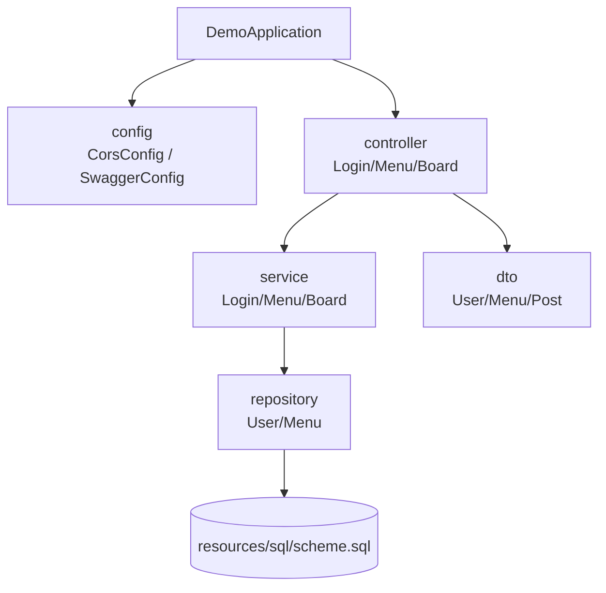

<div align="center">


# 🐢 TurtleLearning

서울시립대학교 소프트웨어공학 해커톤 결과물 기반<br/>
**Spring Boot + Next.js**로 구현한 모바일 친화형 카페/브랜드 웹 서비스

**개발 기간(핵심 구현): 2025.03.21 ~ 2025.03.22 해커톤 1일 집중 개발**

</div>

> 🏆 **해커톤 2등 수상** — 해커톤 결과물의 디자인·구조가 실제 협업 기업 웹사이트 제작에 레퍼런스로 활용됨 → **[freewhale.co.kr](https://www.freewhale.co.kr)**


---

## 📋 목차

1. [프로젝트 소개](#-프로젝트-소개)
2. [Tech Stack](#-tech-stack)
3. [주요 기능](#-주요-기능)
4. [나의 역할 및 구현 내용](#-나의-역할-및-구현-내용)
5. [흐름도](#-흐름도)
6. [Architecture](#-architecture)
7. [설치 및 실행](#-설치-및-실행)
8. [레포지토리 구조](#-레포지토리-구조)
9. [기여자](#-기여자)

---

## 📖 프로젝트 소개

TurtleLearning은 교내 카페/브랜드 콘텐츠를 웹에서 탐색할 수 있도록 만든 서비스입니다.

- **Frontend(Next.js)**: 인트로, 메뉴 카테고리, 커뮤니티, 스토어, 게임형 콘텐츠 화면 제공
- **Backend(Spring Boot)**: 로그인/메뉴/게시판 API 제공
- **목표**: 짧은 기간(해커톤 1일) 내 핵심 사용자 흐름을 빠르게 연결해 시연 가능한 수준의 완성도 확보

| 항목 | 내용 |
|------|------|
| 프로젝트명 | TurtleLearning |
| 개발 형태 | 해커톤 집중 개발 |
| 핵심 기간 | 1일 |
| 플랫폼 | Web |

---

## 🛠 Tech Stack

### Frontend
- Next.js (App Router)
- JavaScript
- CSS Modules / Global CSS

### Backend
- Spring Boot
- Java
- Swagger (API 문서화)

### Data
- SQL schema 기반 데이터 관리 (`src/main/resources/sql/scheme.sql`)

---

## ✨ 주요 기능

| 기능 | 설명 |
|------|------|
| 인트로 페이지 | 브랜드/스토리 소개 및 서브 페이지 구성 |
| 메뉴 페이지 | 음료/디저트/케이터링/MD 카테고리 탐색 |
| 커뮤니티 | 목록/상세/작성 화면 구성 |
| 스토어 | 외부 구매 링크 및 상품 안내 |
| 미니게임 | barista-game 정적 콘텐츠 제공 |

---

## 🙋 나의 역할 및 구현 내용

> 웹사이트 제작 + 교육 게임 제작 두 과제를 동시 선택, 게임을 웹에 통합하는 방향을 직접 기획·주도

### Key Contributions

| Issue | Solution |
|-------|----------|
| 협업 기업의 유튜브 기반 교육 — 레시피 암기 부담·시선 분산으로 학습 효율 저하 | 원인을 '콘텐츠의 재미'가 아닌 **'정보 구조의 부재'** 로 재정의 → 레시피를 **6단계 표준 프로세스 알고리즘** 으로 재설계, 즉각 오답 피드백 시스템 도입 |
| 1일 내 Frontend MVP 필요 | Next.js App Router 기반 전체 화면 골격 구축 (`intro` / `menu` / `community` / `store` / `Menunav` / `Footer`) |
| 메뉴 이미지 API 응답에 URL 필드 누락 | DTO → Service → Repository → Controller 전 레이어 수정으로 프론트-백 데이터 계약 확장 |
| UI 설계 없이 개발 착수 시 방향성 부재 리스크 | 메인화면 Figma 선디자인 후 개발 착수, 시각적 일관성 확보 |

---

## 🔄 흐름도

### User Flow
```text
메인 → 인트로/메뉴 진입 → 카테고리 탐색 → 커뮤니티/스토어 이용 → (선택) 미니게임
```

### Data Flow
```text
Browser (Next.js)
   ↕ HTTP
Spring Boot API
   ↕
Repository/SQL
```

---

## 🏗 Architecture

> 현재 문서/이미지 자산이 없어서, 저장소 구조를 기반으로 Mermaid 다이어그램으로 정리했습니다.

### 1) 시스템 통합 구조


### 2) Frontend 구조


### 3) Backend 구조


---

## ⚙️ 설치 및 실행

### 1) Backend 실행
```bash
git clone <repo-url>
cd TurtuleLearning
./gradlew bootRun
```

### 2) Frontend 실행
```bash
cd frontend
npm install
npm run dev
```

- Backend 기본: `http://localhost:8080`
- Frontend 기본: `http://localhost:3000`

---

## 🗂 레포지토리 구조

```text
TurtuleLearning
├── src/main/java/com/example/demo
│   ├── config
│   ├── controller
│   ├── service
│   ├── repository
│   └── dto
├── src/main/resources
│   ├── sql/scheme.sql
│   └── application.yaml
└── frontend
    ├── src/app
    ├── src/component
    ├── src/style
    └── public

```


---

## 👥 기여자

| 이름 | GitHub | 비고 |
|------|--------|------|
| Park Subin | [@aon0303](https://github.com/aon0303) | 과제 선택·통합 방향 기획 주도 / 프론트엔드 전체 구축 / 게임 알고리즘 설계 / 메뉴 API 확장 |
| youngeun0314 | [@youngeun0314](https://github.com/youngeun0314) | 백엔드 전체 구현 (Spring Boot) |
| - | - | 바리스타 게임 구현 |
